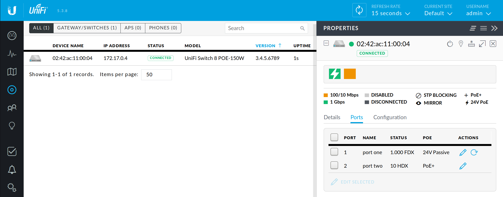

# Integrating a TOUGHswitch with a UniFi controller

The UniFi controller provides integration for Ubiquiti's UniFi hardware. An important element
that is often used with basic UniFi-based WiFi networks, is the
[TOUGHswitch](https://www.ubnt.com/accessories/toughswitch/), which provides
switching and power-over-ethernet capability for the access points. This family of switches,
however, does not integrate with the UniFi controller
(and [it appears Ubiquiti won't do so](https://community.ubnt.com/t5/UniFi-Routing-Switching/Tough-Switch-integration-with-Unifi-4-6/td-p/1191186)).
This project adds basic read-only support for the UniFi controller to TOUGHswitch firmware.

**Important note:** _this is an adaptation of the official TOUGHswitch firmware, independent of
Ubiquiti. It has not been tested thoroughly, and as such it might cause issues, e.g. performance
might suffer. Bricking is very unlikely, but not entirely impossible. You may lose your warranty._




## Build

To build an adapted version of the [TOUGHswitch firmware](https://www.ubnt.com/download/accessories/toughswitch),
you need a number of tools. On [Debian](http://www.debian.org/) or [Ubuntu](https://www.ubuntu.com/desktop)
Linux, installing the following will do. Run:

```sh
sudo apt-get install make gcc libc6-dev zlib1g-dev wget squashfs-tools
```

Then download the latest `dist.build.tar.gz` from
the [releases](https://github.com/wvengen/unifi-controllable-switch/releases) page
and build it:

```sh
tar xzf dist.build.tar.gz
cd build
make firmware
```

This will download the firmware from Ubiquiti. Then it will be unpacked, modified,
and repacked. If all succeeds, this results in a firmware file that you can install directly.


## Install

The resulting firmware file `SW.v<version>.<build_number>+unifi<version>.bin` can be uploaded
using the switch's web interface, and after pressing _Update_ and waiting a couple of minutes,
a UniFi controller running on the same network would show the switch for adoption. The interface
will show _UniFi Switch 8 POE-150W_ for the 8-port TOUGHswitch, and _UniFi Switch 8 POE-60W_ for
the 5-port version.


## Links

* UniFi protocol
 - [Help: What protocol does the controller use to communicate with the UAP?](https://help.ubnt.com/hc/en-us/articles/204976094-UniFi-What-protocol-does-the-controller-use-to-communicate-with-the-UAP-)
 - [jk-5/unifi-inform-protocol](https://github.com/jk-5/unifi-inform-protocol)
 - [fxkr/unifi-protocol-reverse-engineering](https://github.com/fxkr/unifi-protocol-reverse-engineering)
 - [nutefood/python-ubnt-discovery](https://github.com/nitefood/python-ubnt-discovery)
 - [job/ubbnut](https://github.com/jof/ubbnut)
 - [Ubiquiti inform protocol](https://github.com/mcrute/ubntmfi/blob/master/inform_protocol.md)
 - [model identifiers](https://community.ubnt.com/ubnt/attachments/ubnt/UniFi/194506/1/bundles.json.txt)
* UniFi controller docker image at [jacobalberti/unifi](https://hub.docker.com/r/jacobalberty/unifi/)
* [finish06/unifi-api](https://github.com/finish06/unifi-api) - utitilies to manage a UniFi controller
* [sol1/icinga-ubiquiti-mfi](https://github.com/sol1/icinga-ubiquiti-mfi) - parser for mFi `mca-dump`'s json output
* [mcrute/ubntmfi](https://github.com/mcrute/ubntmfi) - web controller for mFi hardware
* OpenWRT on [UniFi AP AC](https://wiki.openwrt.org/toh/ubiquiti/unifiac)
* [TOUGHswitch@wikidevi](https://wikidevi.com/wiki/Ubiquiti_Networks_TOUGHSwitch_PoE_Pro)
